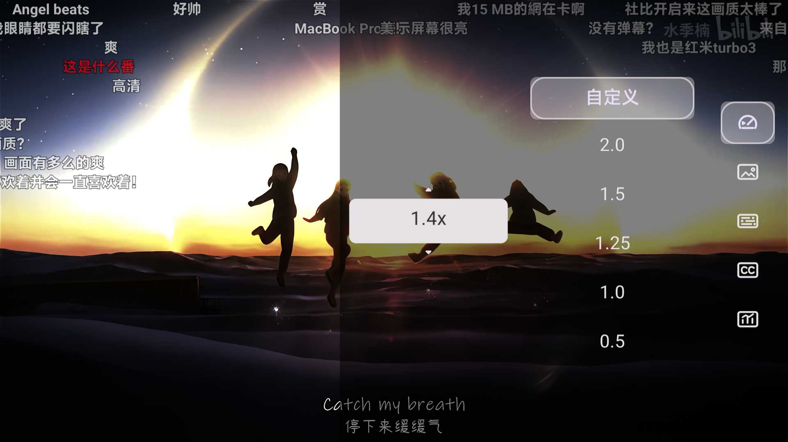
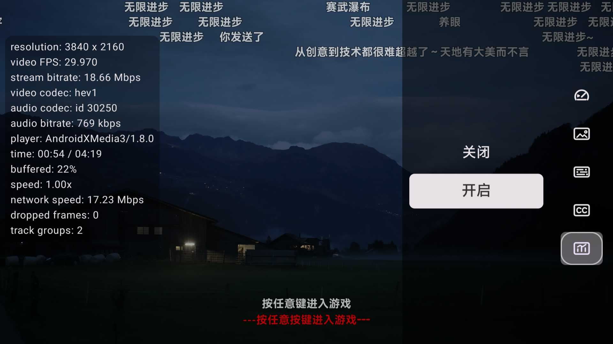
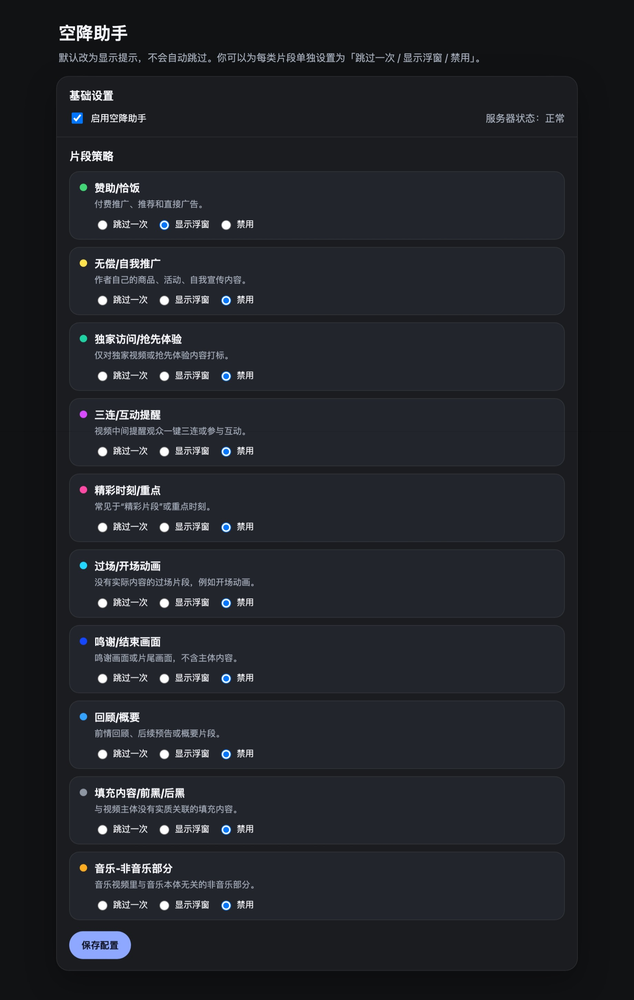
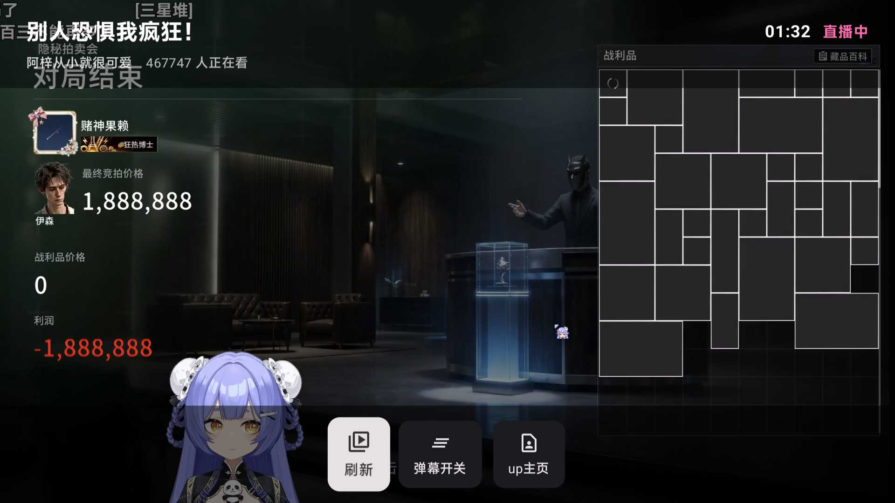
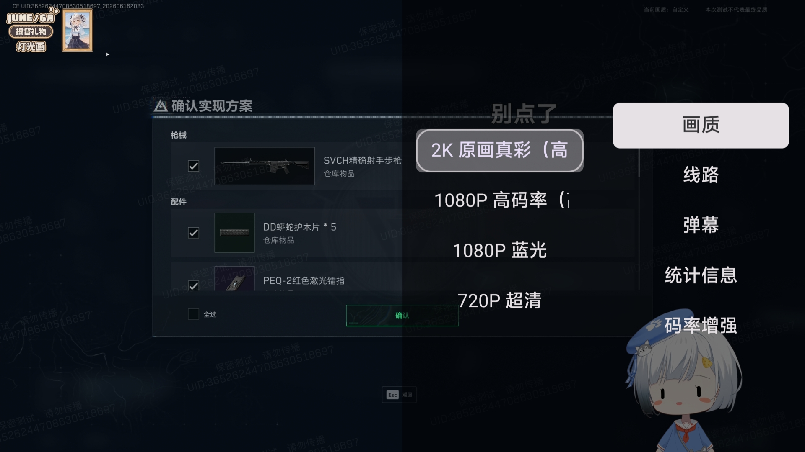
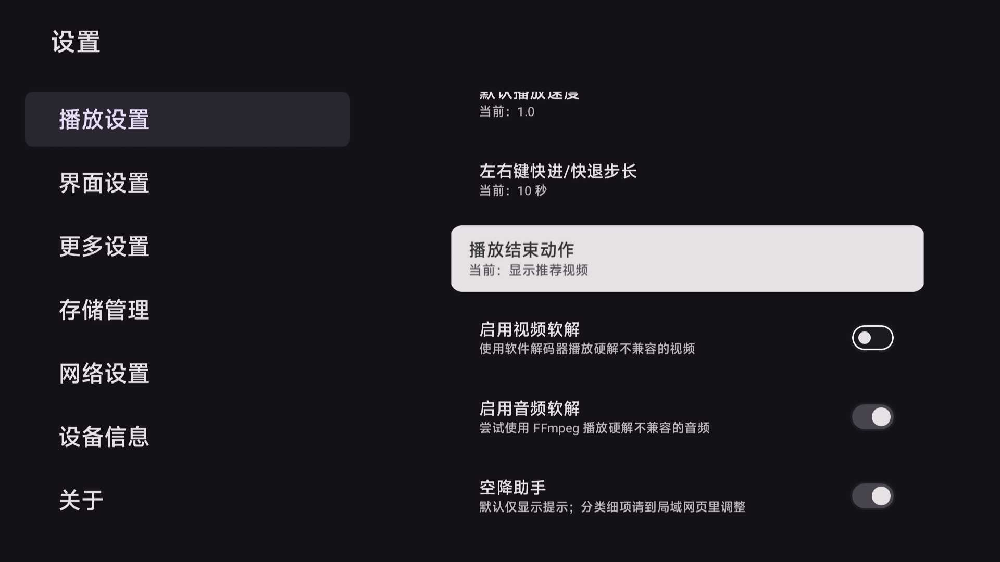
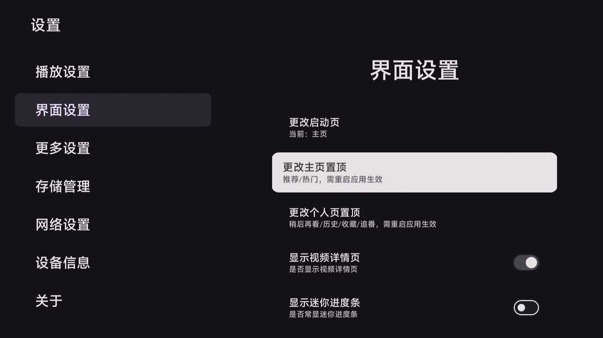
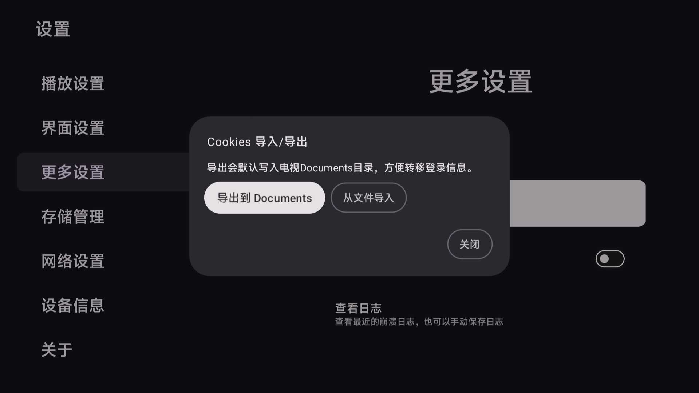

# NeoBV

~~NeoBee Video~~

基于 `aaa1115910/bv` 与 `Frost819/bv` 继续演进，并借鉴 `Hyper-Beast/BiliTV` 部分 UI/UX 的 Android TV 第三方哔哩哔哩客户端。

都是随心乱写的代码，能跑就行。

请尊重 bv 原作者意愿，勿在中国大陆公共社区进行传播。

## 简介

NeoBV 基于 `Kotlin`、`Jetpack Compose for TV`、`Media3` 构建，目标是把视频、影视、直播和播放器体验继续往“更完整、更适合遥控器、更方便长期自用”的方向推进。

如果你原本喜欢 `Frost819/bv` 这条分支的取向，但还想要更完整的播放器 OSD、更聪明的系统机制，以及更适合电视端的浏览体验，甚至是直播功能，那可以尝试下这个版本。

## 亮点

### 重新设计导航栏布局及Icon

- 调整原有的分区逻辑，将原分区入口调整为主页的分区；重绘了部分 icon，特色更鲜明。

- 动态页重做成左侧 `UP 主筛选` + 右侧三列视频网格，更像真正适合电视浏览的布局。

### 更完整的 TV 播放器

- 播放器 OSD 重新补强，标题区直接显示 `UP 主 / 发布时间 / 播放次数 / 观看人数`。
- 视频播放界面，点击一次左右键，立即快进快退 5 秒或 10 秒；连按两次，触发预览，预览时快进快退为 10 秒，点击 ok 键才跳转播放。
- 长按 ok 键触发 2 倍速，松手释放
- 新增`jump mode`，在部分场景下开启 jump mode，按上下键直接切换视频，电视刷视频更顺手。长按下键 3 秒进入/退出。

 

- `播放速度` 增加自定义挡位，日常调节更顺手；`统计信息` 从 debug 版引入正式版，并可手动选择是否开启。

- 下方 OSD 会优先承载更高频的选集合集、up 主页和更多视频操作；半透明浮窗，不干扰观影。

- 播放结束可自动推荐视频。

### SponsorBlock 接入

- 支持使用 SponsorBlock 数据自动跳过片段。
- 支持局域网网页配置分类策略，更适合电视端配合手机或电脑做一次性设置。
- 片段不仅能触发跳过逻辑，还会直接标在播放器大进度条和常显迷你进度条上，颜色与配置页颜色共用同一套映射。

### 直播浏览与播放

- 直播补齐了浏览、播放、右侧菜单、画质选择功能，并初步补齐弹幕链路。

### 更丰富的设置项

- 增加更多的自定义项，例如播放结束动作，左右键快进快退步长。
- Cookies 导入导出调整为导入导出文件，适合迁移登录状态、备份和换设备恢复。

## Todo

- 视频添加评论区功能
- 完善 PGC

## 已知 Bug

- 偶尔搜索会不返回结果，是 b 站风控导致，目前无解，解决方法是过一会儿再用，或者切换 app/web 模式
- 有的视频的 AI 英文字幕、日文字幕无法正常显示
- 直播无法展示实时弹幕
- 界面缩放数值变动异常

## 更新日志

### 0.4.1
- `feat:` 新增`jump mode`,快速切换视频；统计信息菜单增加更多显示项；新增 alpha 更新通道；修改暂停图标。
- `fix:` 修复同时观看人数显示异常；直播界面下长时间静置导致系统休眠。

### 0.4.0

- `feat:` 更改导航布局，替换部分 icon，新增 SponsorBlock 、新版播放器 OSD和操作逻辑、直播、Cookies 导入导出文件和更多自定义设置项。
- `fix:` 修复搜索与索引结果触发时机、字幕与编码选项丢失、索引选项无新年份、影视搜索结果无限重复等问题。

  
<b>展开查看 Frost819/bv 历史更新日志</b>

### 0.3.16 r898

- 修复up主页加载失败
- 更新影视区索引
- 新增启动页面设置，新增个人页置顶设置
- 优化日志管理页显示
- 优化账号管理页显示
- 优化播放进度条显示
- 优化弹幕防遮挡性能

### 0.3.15 r892

- 优化视频播放相关数据加载速度
- 优化弹幕防遮挡蒙版内存占用，解决长视频蒙版过大导致播放器卡死
- 支持付费视频试看功能并增加相关提示；优化播放器内提示显示
- 修复顶端和底端弹幕不显示问题
- 修复app接口弹幕防遮挡显示错误
- 修复竖屏视频判断逻辑错误
- 修复番剧播放失败
- merge pull requests from @wjz2001

### 0.3.14 r877

- 更新弹幕库，优化弹幕滚动流畅度
- 重构详情页底层实现逻辑，增强稳定性
- 增加播放器内相关视频显示，并支持设置连续播放相关视频
- 增加日志管理网页端，优化日志下载体验 @wjz2001
- 修复web接口request was banned报错 @fantasytyx

### 0.3.13 r853

- 重构播放器页面底层实现逻辑
- 调整弹幕播放速度设置，修复调整速度导致时间轴不匹配
- 优化智能弹幕防挡蒙版逻辑
- 优化进度条缩略图缓存逻辑
- 修复播放PGC时代理不生效

### 0.3.12 r838

- 增加弹幕速度设置；优化设置项布局
- app接口推荐页视频卡片增加投稿时间和播放量显示
- 修改开屏背景为黑色
- 优化字幕显示逻辑；优化视频卡片播放量、弹幕数显示
- merge 优化进度条缩略图的流畅度和内存占用，修复快进/快退崩溃的问题 @fantasytyx
- 修复播放部分视频因播放列表存在失效视频导致的闪退问题
- 修改VideoInfo页滚动逻辑，修复推荐视频卡片显示不全
- 更新更加防风控的web UA

### 0.3.11 r829

- 所有页面的视频卡片均支持长按快捷操作
- 稍后再看页可长按删除稍后再看
- 优化搜索加载逻辑
- 重构视频grid焦点滚动逻辑，避免选中卡片显示不全
- 优化视频详情页底边距

### 0.3.10 r826

- 恢复web接口获取播放地址，更新UA，修复request was banned和403 Forbidden
- 重构播放器加载分P和合集的逻辑，历史续播可跳转到对应分P
- 重做播放器内视频列表，可同时显示合集和分P

### 0.3.9 r822

- 因b站风控加强，暂时屏蔽web接口获取播放地址，并更换http client UA
- 修复因个别番剧（如凡人修仙传）播放量超过int最大值导致不显示追番
- 优化搜索功能逻辑
- 播放器默认全屏显示
- 再次尝试解决视频详情页面崩溃问题

### 0.3.8 r817

- 稍后再看分组为“未看完”和“已看完”
- 优化个人页和动态页内容为空和加载时的状态显示
- 增加视频软解选项
- 修复卡片快捷键无法进入详情页
- 修复标签页视频时长显示错误
- 优化ugc页导航栏布局
- 更改搜索结果和番剧列表筛选为菜单键触发
- 增加搜索结果筛选提示
- 修复动态id过长导致动态不显示
- 替换镜像站，修复更新失败问题
- 增加推荐、热门页列表末尾兜底文案

### 0.3.7 r810

- 修复web搜索无结果问题
- 修复up主页为空的问题
- 修复UGC页视频重复问题
- merge 修复 PGC 详情页不显示非正片内容
- 主页（动态、推荐、热门）新增长按视频卡片快捷操作：添加到稍后再看、进入信息页、进入up页
- 调整个人页tab顺序（置顶稍后再看），配合快捷添加稍后再看的逻辑
- 搜索结果导航栏优化

### 0.3.6 r798

- 修复字幕无法获取的问题
- AI字幕增加标识
- 增加投稿视频分P和分季的播放历史按钮，可快速跳转到历史进度继续播放

### 0.3.5 r795

- 增加常显进度条及其设置，优化常规进度条显示
- 增加详情页的充电视频提示（未付费会导致播放器抽风报错）
- 视频信息页增加播放量显示，且各数据均会按万显示
- 二次确认退出播放器的逻辑不再区分播放状态
- 个人页所有tab支持菜单键刷新
- 修复只能获取AI字幕导致字幕缺失(目前web接口字幕获取偶尔会抽风)
- 删除旧版播放器及其设置

### 0.3.4 r790

- 修复App接口动态无法加载
- 优化定时器线程使用，预计减少闪退
- 更新github镜像源进行在线更新
- 修复视频播放列表错乱问题

### 0.3.3 r787

- 增加首页设置：动态/推荐/热门
- 增加播放结束动作设置
- 播放器不再嵌套运行，避免奇怪bug
- 修复获取不到历史进度的问题

### 0.3.2 r782

- 添加搜索页热词的隐藏按钮，跟随持久设置
- 播放器快捷键增加单视频循环开关和up主页键
- 重构设置页，简化合并设置项，并增加默认播放速度设置

### 0.3.1 r772

- 个人页（收藏、历史、稍后再看、追番）独立到左侧新导航栏
- 账号弹窗重做，不再显示账户页
- 优化分区页切换tab栏加载速度
- 合并原版删除搜索记录功能
- 视频内信息页集成快进快退功能，增加进度条下方快捷按钮
- 修复弹幕播放器内存溢出导致的无响应崩溃
- 当视频时长大于1小时显示小时:分:秒格式

### 0.3.0 r759

- 适配在线更新功能，基于github release
- merge多个原版0.3.0的更新，包括依赖更新和bug fix
- 父子焦点逻辑更新，预计降低闪退频率
- 修复web接口搜索无结果bug
- 修复小米电视首页刷新闪退
- 修复视频中按上键显示视频列表闪退

### 0.2.10 r742

- 因小米电视屏蔽更换包名，需重新安装
- 重写主页、分区页列表逻辑，大幅提升滚动流畅度
- 动画简化
- 菜单键刷新功能同步到分区页和影视页
- web接口字幕错乱、主页导航栏焦点重置bug fix

### 0.2.10 r737

- 主页导航栏重做，不再作为抽屉展开
- 大部分场景的视频卡片新增投稿时间（参考了@Leelion96的代码，感谢）
- ugc页面优化，删除无用的子分区
- 视频详情页不再显示模糊封面背景，提高性能
- 修复了播放器内选项页焦点问题导致的闪退bug
- 动态、热门、推荐页内按菜单键可刷新视频列表（follow BBLL）

### 0.2.10 r733

- 优化视频详情页分P逻辑，不再优先显示合集
- 优化播放器内信息显示，时钟不再显示秒
- 合入原repo对无法播放h.265格式的bug fix

### 0.2.10 r732

- 新增是否显示视频详情页设置项（界面设置），关闭后点击视频直接播放
- 导航抽屉选项需按确定键才切换content，不再跟随focus切换（减少卡顿）

### 0.2.10 r730

- 增加点赞投币按钮和长按点赞一键三连
- 优化视频grid卡片标题显示（标题改为2行且宽度增加）

### 0.2.10 r728

- 播放设置中播放速度单独列出，改为0.5, 1, 1.25, 1.5, 2倍速挡位
- 优化视频中按下键显示的视频信息布局

## Star History

## 免责声明

- 本项目仅供学习、交流与个人研究使用。请于下载后24小时内删除。
- 请自行评估所在地区、网络环境、账号状态和设备兼容性带来的影响。
- 第三方接口、播放可用性、直播状态和画质能力可能随上游服务变化而变化。

## 致谢

- 上游项目：[aaa1115910/bv](https://github.com/aaa1115910/bv)
- 分支基础与长期维护参考：[Frost819/bv](https://github.com/Frost819/bv)
- UI/UX灵感参考：[Hyper-Beast/BiliTV](https://github.com/Hyper-Beast/BiliTV)
- 部分直播接口与实现思路调研时参考了社区公开项目和文档
- 感谢 v2ex linux.do nodeseek 提供的平台供分享项目

# 请记得 bbll 的前车之鉴，不要在国内社区传播哈。

## License

本项目继续采用 [MIT License](LICENSE)。

请保留原始版权与许可声明：

- Copyright (c) 2022 `aaa1115910`
