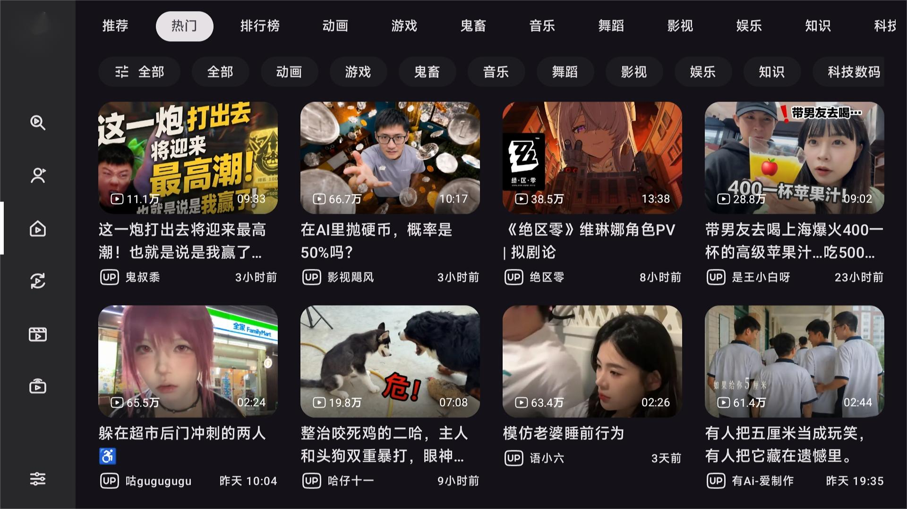
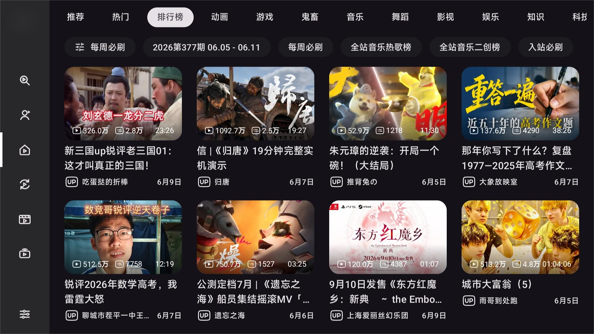
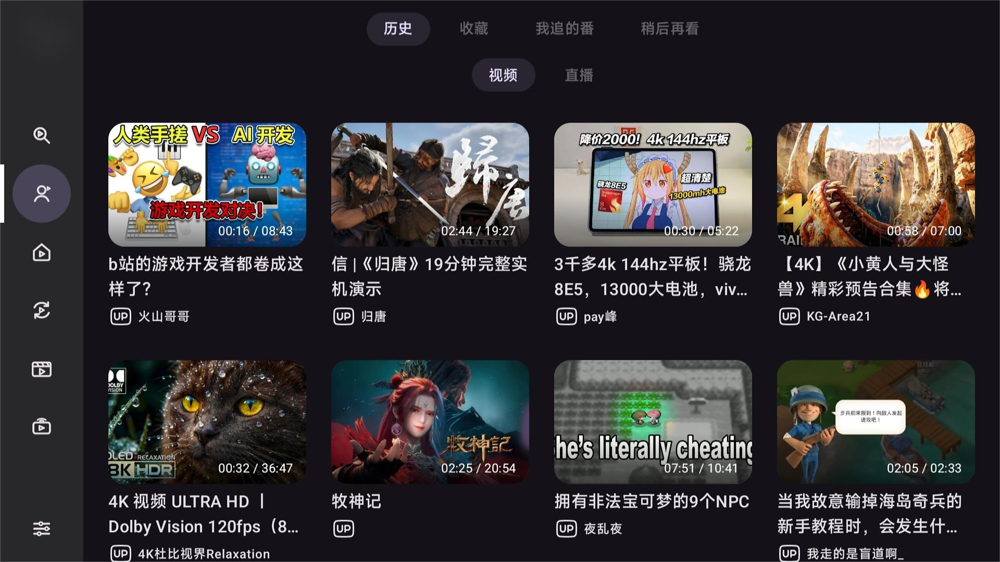
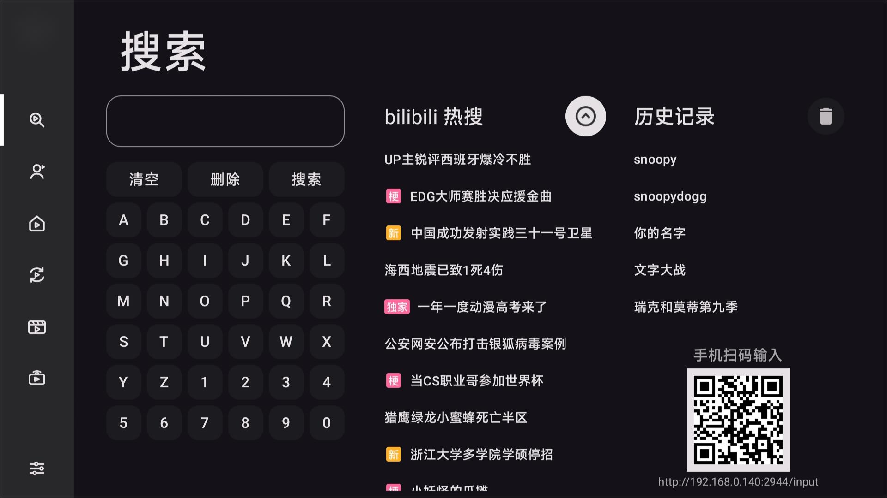
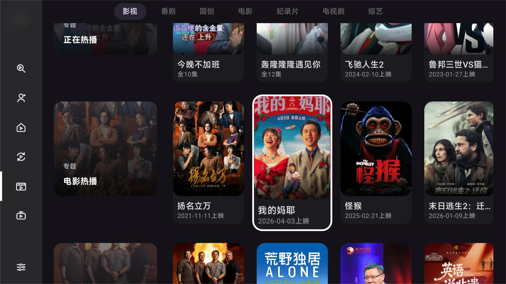
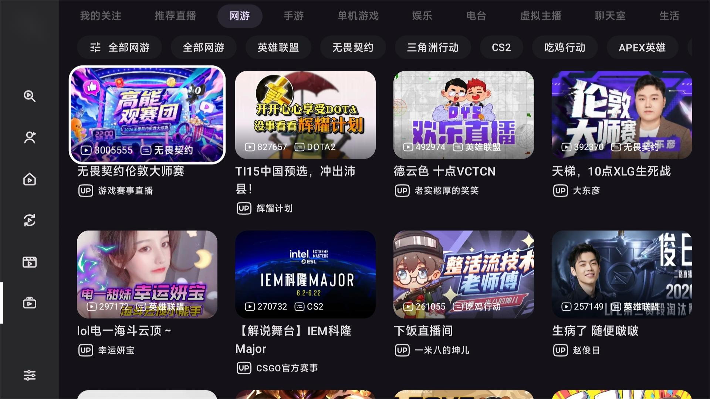
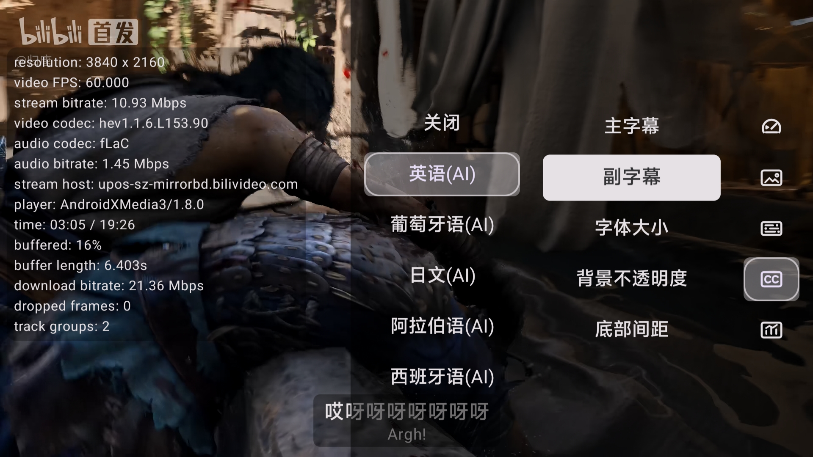
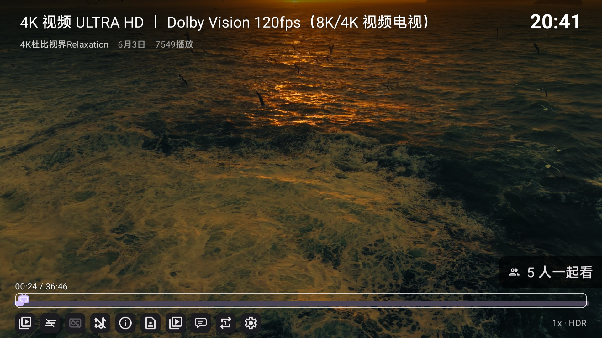
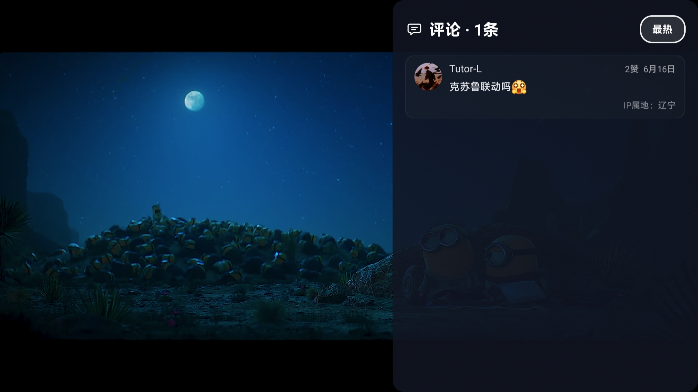
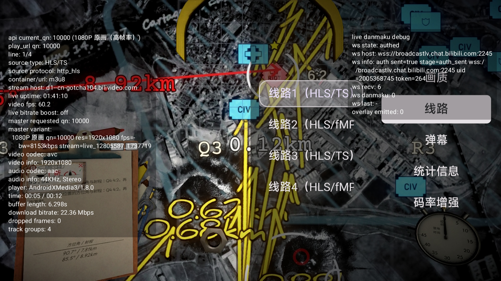

# NeoBV

~~NeoBee Video~~

基于 `aaa1115910/bv` 与 `Frost819/bv` 继续演进的 Android TV 第三方哔哩哔哩客户端。

都是随心乱写的代码，能跑就行。

请尊重 bv 原作者意愿，勿在中国大陆公共社区进行传播。

## 简介

NeoBV 基于 `Kotlin`、`Jetpack Compose for TV`、`Media3` 构建，目标是把视频、影视、直播和播放器体验继续往“更完整、更适合遥控器、更方便长期自用”的方向推进。

## 亮点与特色

### 页面概览

---

### 特色功能

#### 播放

- **视听体验升级**：增强部分版权影视的播放能力，可在设置页中查看设备的 Widevine DRM 。
- **播控交互优化**：视频播放时点击左右键可立即快进快退，连按两次触发“预览模式”，长按 OK 键快捷触发临时 2 倍速。

#### 播放器菜单

 

- **右侧 OSD 菜单**：支持丰富的自定义，如双语字幕切换、播放速度自定义挡位、详细的播放统计信息等。

- **下方 OSD 菜单**：半透明浮窗设计，承载高频的分P与合集选集、UP 主空间展示。
- **评论区支持**：集成评论区展示，支持 B 站各类经典表情包的正常渲染与显示。

#### SponsorBlock

- 支持使用 SponsorBlock 数据自动跳过视频广告或无意义片段。
- 支持局域网网页端便捷配置跳过策略。
- 标记的片段会直接渲染在播放器大进度条与常显迷你进度条上，颜色与配置页保持一致。

#### 直播

- 直播版块补齐了分类筛选、播放、下方与右侧 OSD 菜单以及详细的直播播放统计信息。
- 直播底部 OSD 增加设置与布局配置选项，支持画质切换与弹幕自定义。
- **码率增强为实验性功能，建议不要开。**

#### 设置

- **细致的系统设置**：包括播放结束动作、左右键快退快进步长、自定义布局、弹幕屏蔽等丰富的自定义设置项。
- **DLNA 投屏**：适配 Bilibili 官方投屏（包含直播）及 piliplus，可突破b站官方投屏清晰度限制；以及通用DLNA投屏（在 115 网盘、yamby 上测试通过）。
- **Cookies 导入导出**：调整为文件导入导出，便于多台电视或设备间迁移登录状态。

#### 触控

具体请自行下载体验

## Todo

- 弹幕密度设置
- 播放器章节信息展示
- 视频长按菜单增加“不感兴趣”功能
- 完善 PGC 的部分交互
- **AppleTV 版本**

## 已知 Bug

- 偶尔搜索会不返回结果，是 b 站风控导致，目前无解，解决方法是过一会儿再用，或者切换 搜索的 app/web 接口
- 部分设备界面缩放数值变动异常

## Star History

## 隐私与免责声明

- 本项目仅供学习、交流与个人研究使用。请于下载后24小时内删除。
- 请自行评估所在地区、网络环境、账号状态和设备兼容性带来的影响。
- 第三方接口、播放可用性、直播状态和画质能力可能随上游服务变化而变化。
- 本软件默认开启崩溃分析，alpha 版本默认开启数据统计，不会搜集任何敏感信息。

## 致谢

- 上游项目：[aaa1115910/bv](https://github.com/aaa1115910/bv)
- 分支基础与长期维护参考：[Frost819/bv](https://github.com/Frost819/bv)
- UI/UX灵感参考：[Hyper-Beast/BiliTV](https://github.com/Hyper-Beast/BiliTV)，[jay3-yyBiliPai](https://github.com/jay3-yy/BiliPai)
- 投屏逻辑与实现参考：[xbmc/xbmc (Kodi)](https://github.com/xbmc/xbmc)
- 部分直播接口与实现思路调研时参考了社区公开项目和文档
- 感谢 v2ex linux.do nodeseek 提供的平台供分享项目

## 赞助

这是一个为爱发电的项目， 赞助的钱将用来鼓励开发者迭代版本，提高程序可用性与功能性。谢谢你们❤️点star当然也算赞助啦

或者->
[赞助自己的观看体验](https://account.bilibili.com/big)

# 请记得 bbll 的前车之鉴，不要在国内社区传播哈。

## License

本项目继续采用 [MIT License](LICENSE)。

请保留原始版权与许可声明：

- Copyright (c) 2022 `aaa1115910`
